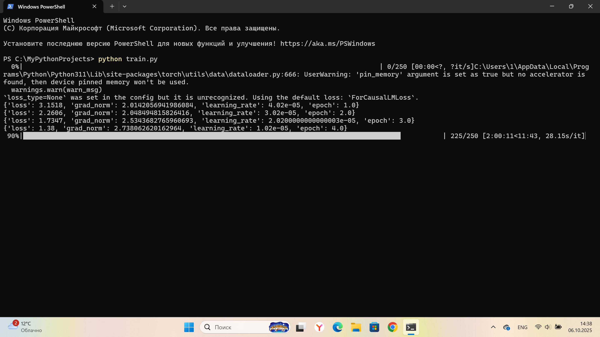
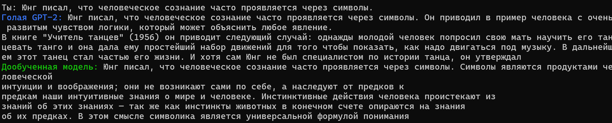

# RuGPT Fine-Tuning Project

Проект демонстрирует обучение и использование русскоязычной модели GPT (RuGPT3) на примере книги Юнга «Человек и его символы».  
Проект включает:

- Fine-tuning модели на собственных данных
- Сравнение работы базовой и дообученной модели
- Примеры генерации текста и интерактивный чат

## Структура проекта
```bash
gpt2_finetune/
│
├─ trainer/
│ └─ train.py # Код для обучения модели
│
├─ inference/
│ └─ gpt.py # Запуск голой и дообученной модели
│
├─ data/
│ └─ yung.txt # Текст книги Юнга для обучения
│
├─ images/
│ ├─ training.png # Скриншот процесса обучения
│ └─ tuned.png # Пример ответа дообученной модели
│
└─ README.md # Это описание проекта
```


## 1) Fine-tuning модели

**Файл:** `trainer/train.py`

- Загружает предобученную RuGPT3 large  
- Создаёт `Dataset` из текстовых файлов в папке `data/`  
- Нарезает тексты на блоки фиксированной длины для обучения  
- Обучает модель с помощью `Trainer` из `transformers`  
- Сохраняет модель и токенизатор в `rugpt3_finetuned/`  

**Пример скриншота обучения:**  


---

## 2) Использование голой и дообученной модели

**Файл:** `inference/gpt.py`

- Загружает базовую RuGPT3 и дообученную модель из `rugpt3_finetuned/`  
- Определяет функцию генерации текста с контролем температуры, top-k, top-p  
- Запускает интерактивный чат в консоли  
- Сначала выводит результат голой модели, затем дообученной  

**Пример работы дообученной модели:**  


---

## 3) Установка и запуск

1. Установите зависимости:

```bash
pip install torch transformers
```
2. Разместите данные для обучения в папке data/ (например, yung.txt)

3. Запустите обучение модели:
```bash
python trainer/train.py
```
После обучения можно запустить чат:
```bash
python inference/gpt.py
```

**4) Особенности проекта**   
-Используется RuGPT3 large на базе GPT-2 от Sberbank  
-Подготовка данных включает нарезку текстов на блоки для language modeling  
-Функция генерации поддерживает случайность и контроль повторов  
-Интерактивный чат позволяет сравнивать голую и дообученную модели  

**5) Примечания**    
-Папка images/ содержит скриншоты обучения и примеров работы  
-Папка data/ содержит тексты для обучения  
-Модель сохраняется в rugpt3_finetuned/ после обучения  
